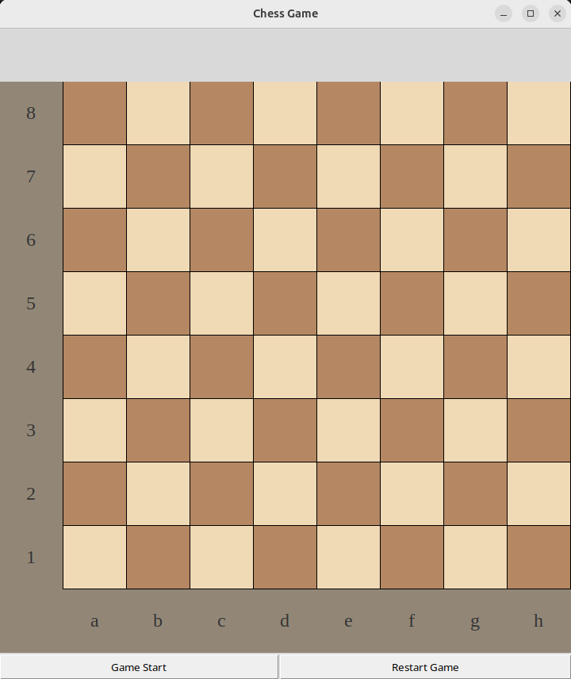
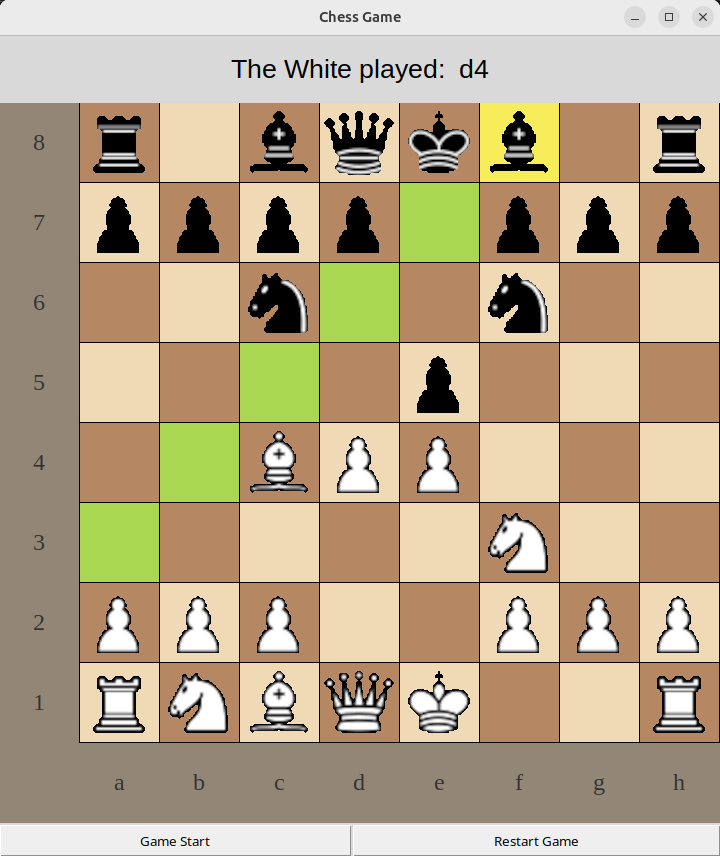
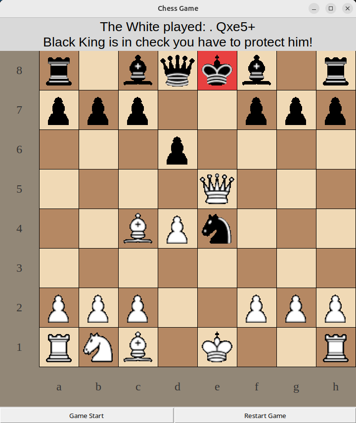
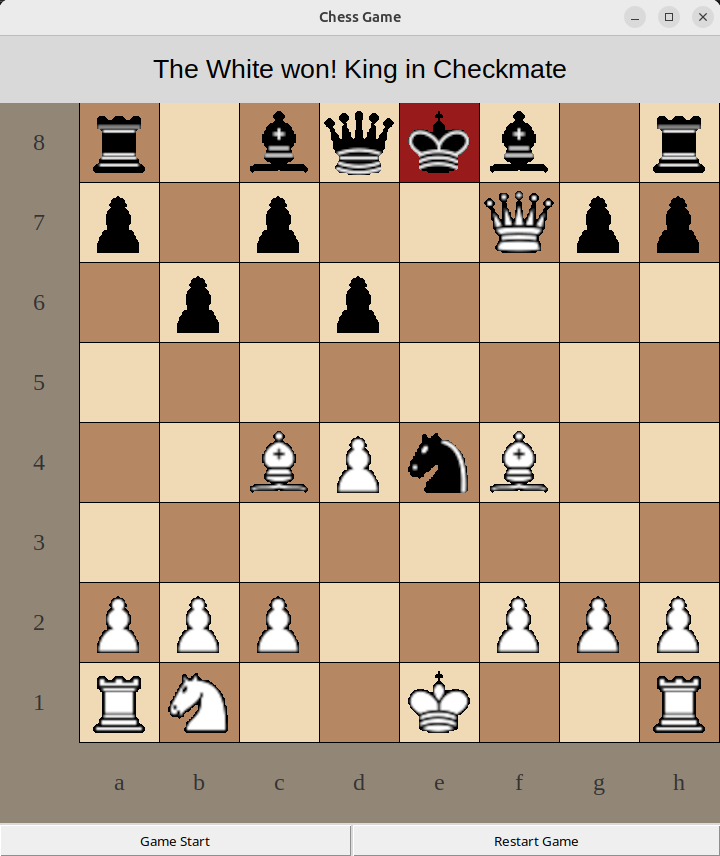
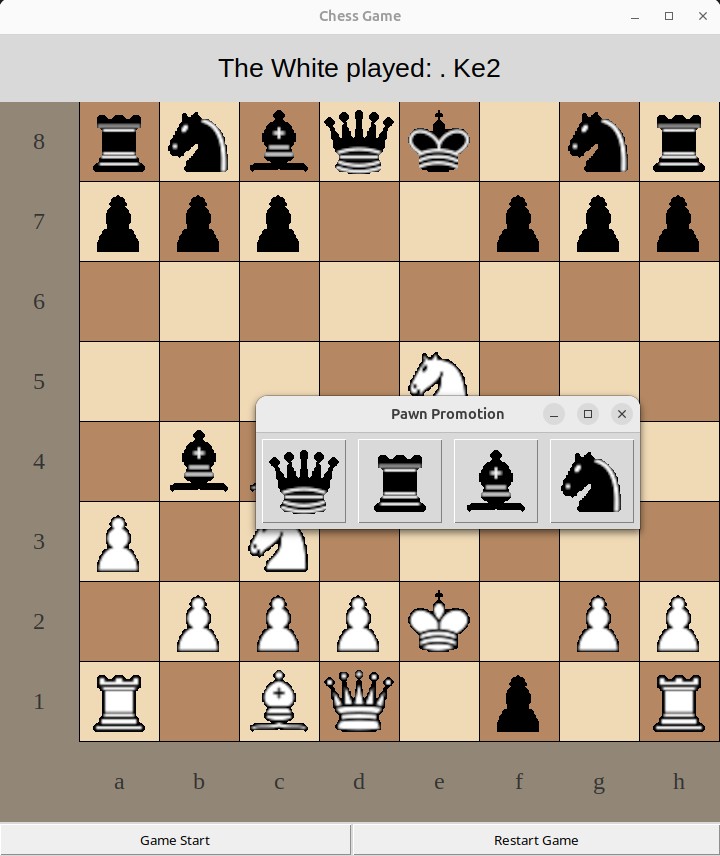

# ♟ Python Chess Application

A complete chess application built entirely in Python — featuring a rules-compliant engine, a graphical interface, and 150 automated pytest tests across 9 categories. Designed as a portfolio project to demonstrate object-oriented design, algorithmic thinking, GUI development, and test automation.

## Table of Contents

- [Features](#features)
- [Screenshots](#screenshots)
- [Getting Started](#getting-started)
- [Project Structure](#project-structure)
- [Chess Engine](#chess-engine)
- [Graphical Interface](#graphical-interface)
- [Testing](#testing)
- [Design Decisions](#design-decisions)
- [Future Roadmap](#future-roadmap)
- [Author](#author)

## Features

### Chess Engine
- Complete implementation of all chess piece movements
- Two-pass move generation: non-King pieces first, then Kings (ensures check flags are set before castling evaluation)
- Legal move filtering via simulate-and-undo approach
- Check detection using ray-casting from the King's position
- Checkmate and stalemate detection through exhaustive legal move enumeration
- Castling — kingside and queenside for both colors, with full path and attack validation
- En passant — history-aware, available only as an immediate response
- Pawn promotion with GUI dialog (Queen, Rook, Bishop, Knight)
- Pin awareness — filter_legal_moves catches all absolute pins

### Graphical Interface
- 8x8 board drawn programmatically using tkinter Canvas
- Lichess-inspired color palette (`#b58863` / `#f0d9b5`)
- GIF sprite sheet (480x160) sliced into 12 piece images at 80x80 pixels
- Click-to-move interaction with two-click selection system
- Visual feedback with color-coded highlighting:
  - **Yellow** (`#f7ec59`) — Selected piece
  - **Green** (`#aad751` / `#7db83a`) — Legal moves (light/dark square variants)
  - **Red** (`#e84040`) — King in check
  - **Dark Red** (`#991a1a`) — King in checkmate
  - **Blue-Grey** (`#5a7d9a`) — Draw
- Turn enforcement — only the current player's pieces are selectable
- Move history display in the History Frame
- Modal promotion dialog using `tk.Toplevel` with `wait_window()`
- Game Start and Restart buttons

### Testing
- 150 automated tests covering 9 categories
- Full pytest integration with fixtures, markers, and selective test execution
- Standalone test runner also available (no pytest required)

## Screenshots

- Initial board


- Piece selected with legal moves


- Check highlight


- Checkmate position


- Promotion dialog


## Getting Started

### Prerequisites

- Python 3.10 or higher (required for `match`/`case` syntax)
- tkinter (included with standard Python installation)

### Installation

```bash
git clone https://github.com/GeorgiosGiosmas/Chess.git
cd Chess
pip install -r requirements.txt
```

### Running the Game

```bash
python main_game.py
```

1. Click **Game Start** to initialize the board
2. Click a piece to select it — legal moves appear in green
3. Click a green square to make the move
4. Click the selected piece again to deselect it
5. Click **Restart Game** to reset

### Running the Tests

```bash
# Pytest (recommended)
pytest tests/ -v                    # Run all 150 tests
pytest tests/ -v -m castling        # Run only castling tests (23 tests)
pytest tests/ -v -m en_passant      # Run only en passant tests (13 tests)
pytest tests/ -v -m pins            # Run only pin tests (12 tests)
pytest tests/ -v -k "fork"          # Search tests by keyword
pytest tests/ -v -s                 # Show board printouts during tests

# Standalone (no pytest required)
python test_engine.py               # 150 tests with pass/fail summary
```

## Project Structure

```
Chess/
├── piece.py                 # Piece base class + 6 subclasses
│                            # Each subclass implements piece_get_valid_moves()
│                            # Handles movement rules, captures, and check detection
│
├── board.py                 # Board (8x8 grid) and Square classes
│                            # Move generation (two-pass), legal move filtering
│                            # Check/checkmate/draw detection, make_move execution
│
├── gui.py                   # ChessGameGUI class
│                            # Canvas drawing, sprite rendering, click handling
│                            # Highlighting, promotion dialog, game state display
│
├── main_game.py             # Entry point — creates Board + GUI, launches mainloop
│                            # Also contains terminal-mode functions (legacy)
│
├── Chess_Pieces_Sprite.gif  # Sprite sheet — 480x160, 6 pieces x 2 colors
│
├── test_engine.py           # 150 standalone tests (no pytest required)
│                            # Openings, piece movement, check, checkmate,
│                            # stalemate, castling, en passant, pins, tactics
│
├── tests/                   # Pytest test suite
│   ├── conftest.py          # Shared fixtures: board_with_pieces, empty_board
│   │                        # Helper functions: place_piece, make_move, compute_moves
│   └── test_engine_pytest.py # 150 pytest tests organized into 9 test classes
│                            # Markers: @pytest.mark.castling, .en_passant, .pins, etc.
│
├── pytest.ini               # Pytest configuration — registers custom markers
└── requirements.txt         # Python dependencies (pytest)
```

## Chess Engine

### Two-Pass Move Generation

The engine computes moves in two passes to handle check detection correctly:

**Pass 1 — Non-King Pieces:** All pawns, knights, bishops, rooks, and queens compute their valid moves. When a piece's move reaches the opponent's King, the corresponding check flag is set.

**Pass 2 — Kings:** Kings compute their moves using `is_square_attacked_by()`, which checks if any opponent piece controls a target square. Castling eligibility is evaluated here, requiring the check flags from Pass 1 to be fully set.

### Legal Move Filtering

After both passes, `filter_legal_moves()` performs a simulate-and-undo loop:

1. For each piece's candidate move, simulate the move on the board
2. Check if the player's own King is still attacked using `is_king_in_check_raw()`
3. Undo the move regardless of the result
4. Only moves that leave the King safe are kept

This approach catches all absolute pins, discovered checks, and illegal King moves in a single pass.

### Check Detection — Ray Casting

`is_king_in_check_raw()` checks from the King's position outward in all directions:
- **Straight lines** (4 directions) — looks for Rooks or Queens
- **Diagonals** (4 directions) — looks for Bishops or Queens
- **L-shapes** (8 positions) — looks for Knights
- **Diagonal adjacents** (2 positions) — looks for Pawns
- **All adjacents** (8 positions) — looks for the opponent King

## Graphical Interface

### Event-Driven Architecture

The GUI replaced the engine's original blocking `while True` loop with tkinter's event model. The `move_piece()` click handler serves as the game loop:

1. Convert pixel coordinates to board coordinates
2. If no piece selected → highlight clicked piece and show legal moves
3. If piece selected and destination is valid → execute move, redraw board, compute new moves, check game state
4. If piece selected and same square clicked → deselect
5. Return control to `mainloop()` and wait for next click

### Coordinate System

The canvas origin is top-left (0,0), while the chess board has rank 1 at the bottom. Two helper functions handle the translation:

- `from_gui_to_board(x, y)` → converts canvas coordinates to board indices
- `from_board_to_gui(x, y)` → converts board indices to canvas coordinates

Square colors are computed mathematically via `(rank + file) % 2`, avoiding state tracking entirely.

### Sprite Sheet Rendering

The 480x160 GIF sprite sheet contains 12 pieces (6 types x 2 colors) at 80x80 pixels each. `subimage()` extracts individual pieces using tkinter's `PhotoImage` copy command, storing them in a dictionary keyed by piece string (e.g., `"KW"`, `"PB"`).

## Testing

### Test Coverage — 150 Tests

| Category | Tests | Description |
|----------|-------|-------------|
| Opening Positions & Basic Moves | 15 | Move counts, Italian Game, Sicilian, Queen's Gambit, Ruy Lopez |
| Piece Movement Validation | 22 | All 6 piece types — movement, captures, blocking, corner/edge cases |
| Check Detection | 14 | Rank/file/diagonal checks, knight checks, blocking, king restrictions |
| Checkmate Patterns | 22 | Queen+King, ladder, Fool's mate, Scholar's mate, back rank, smothered, Anastasia |
| Stalemate / Draw | 9 | Classic stalemate, edge stalemate, pawn breaks stalemate |
| Castling | 23 | Both sides, both colors, all blocking conditions, execution verification |
| En Passant | 13 | Left/right capture, expiration, black en passant, edge files, execution |
| Pins | 12 | Absolute pins by rook/bishop/queen, movement along pin line, pinned pawns |
| X-Ray & Tactics | 20 | Knight forks, batteries, bishop pair, captures, notation, board reset, game flows |

### Pytest Integration

The test suite is fully integrated with pytest through a `tests/` directory:

- **`conftest.py`** — Shared fixtures (`board_with_pieces`, `empty_board`) and helper functions (`place_piece`, `make_move`, `compute_moves`)
- **`test_engine_pytest.py`** — 150 tests organized into 9 classes, one per category
- **Custom markers** — `@pytest.mark.openings`, `@pytest.mark.castling`, `@pytest.mark.en_passant`, `@pytest.mark.pins`, `@pytest.mark.check`, `@pytest.mark.checkmate`, `@pytest.mark.stalemate`, `@pytest.mark.tactics` for selective execution
- **`pytest.ini`** — Registers all custom markers

A standalone `test_engine.py` is also available for running all 150 tests without pytest.

## Design Decisions

| Decision | Rationale |
|----------|-----------|
| **Mathematical state over tracked state** | Square colors computed via `(rank + file) % 2` — eliminates state management bugs |
| **Two-pass move generation** | Non-King pieces first, then Kings — ensures check flags are set before castling evaluation |
| **Canvas.delete("all") + full redraw** | Prevents ghost images from castling, en passant, and captures |
| **Separate highlight functions** | Selected-square and valid-move highlighting are independent systems — avoids tangling |
| **Event-driven over blocking loop** | Replaced `while True` with click handler as game loop — compatible with tkinter |
| **Turn check inside highlight_square** | Single line `piece.colour == self.current_turn` enforces turns without cluttering move_piece |

## Future Roadmap

| Phase | Feature | Description |
|-------|---------|-------------|
| 1 | **AI Opponent** | Minimax with alpha-beta pruning, material + positional evaluation |
| 2 | **Drag & Drop** | B1-Motion event handling for piece dragging |
| 3 | **Board Flipping** | Play as black with reversed board orientation |
| 4 | **Custom Piece Sprites** | AI-generated 80x80 pixel art chess pieces |

## Skills Demonstrated

- **Object-Oriented Design** — Inheritance hierarchy (Piece base class, 6 subclasses), encapsulation, polymorphism
- **Algorithmic Thinking** — Ray-casting for sliding pieces, simulate-and-undo for legal moves, L-shape offsets
- **GUI Development** — tkinter Canvas, sprite extraction, event binding, modal dialogs, coordinate mapping
- **Software Architecture** — Clean engine/GUI separation, event-driven design, state management
- **Testing & QA** — 150 pytest tests with fixtures, markers, and selective execution

## Author

**Georgios Giosmas**
- Electrical & Computer Engineering Graduate
- GitHub: [GeorgiosGiosmas](https://github.com/GeorgiosGiosmas)

## License

This project is open source. See [LICENSE](LICENSE) for details.
